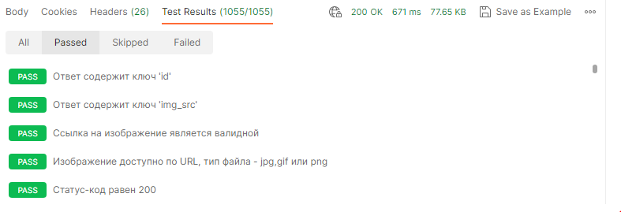

# Postman - NASA

Данный тестовый сценарий, демонстрирует метод валидации контента JSON в responseBody полученного через GET запрос к серверу https://api.nasa.gov

Версия Postman: 10.12.11

Тестовый запрос: https://api.nasa.gov/mars-photos/api/v1/rovers/curiosity/photos?earth_date=2022-01-21&api_key=DEMO_KEY

Тестируемый ответ: [JSON](response.json)

Файл коллекции: [postman collection](postman_collection.json)

Тестовый сценарий:

``` JavaScript
// Получаем JSON-ответ сервера для дальнейшей обработки
var jsonData = pm.response.json();
// Обходим каждый элемент массива 'photos', выводим в консоль информацию о прохождении теста
jsonData.photos.forEach((photo,index) => {
  // Test 1: Проверяем, что JSON ответ содержит ключ 'id и его значение является числом
  pm.test("Ответ содержит ключ 'id'", () => {
    pm.expect(photo).to.have.property('id');
    pm.expect(typeof photo.id).to.equal('number');
    console.log(`ID фото: ${photo.id}`);
    console.log(`Индекс фото: ${index}`);
  });
  // Test 2: Проверяем наличие ключа со ссылкой на ресурс с изображением
  pm.test("Ответ содержит ключ 'img_src'", () => {
    pm.expect(photo).to.have.property('img_src');
    console.log(`Ссылка на фото: ${photo.img_src}`);
  });
  // Test 3: Проверяем валидность ссылки на изображение и тип файла ресурса
  pm.test("Ссылка на изображение является валидной, тип файла - jpg или png", () => {
    pm.expect(photo.img_src).to.match(/^https?:\/\/\S+/);
    console.log(`Ссылка валидна`);
  });
  // Test 4: Проверяем наличие контента JPG или PNG на URL
  pm.test("Изображение присутствует по ссылке, тип файла - jpg или png", () => {
      pm.sendRequest(photo.img_src, function (err, response) {
      pm.expect(response.headers.get("Content-Type")).to.match(/^image\/(jpeg|png)$/);
      console.log(`Файл доступен по URL`);
    });
  });
  // Test 5: Проверяем статус-код HTTP-ответа, чтобы убедиться, что он равен 200
  pm.test("Статус-код равен 200", () => {
    pm.response.to.have.status(200);
    console.log(`Статус код 200`);
  });
});
```
Результат запуска тестов в Postman:



Успехов в Вашей работе!
